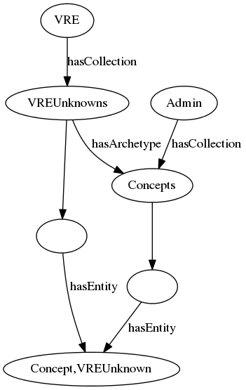
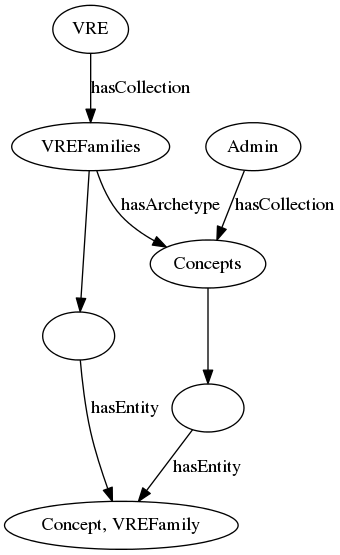
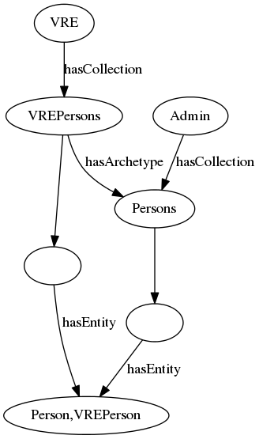

# RDF import

Iedere zin (i.e. na iedere punt) op een nieuwe regel beginnen geeft leesbaardere git diffs.

## Context
RDF is a widely used linked data format. Therefore Timbuctoo has to communicate with a with services through the RDF data format. This package contains a mapping to convert RDF to the
Timbuctoo native graph format. (Ik denk dat je hier beter property graph, of tinkerpop native property graph kan noemen) The RDF syntax we support are n-quads. Because n-quads are a superset of n-triples we support that format as well. 

The code for the RDF import can be found in the package [nl.knaw.huygens.timbuctoo.rdf](https://github.com/HuygensING/timbuctoo/tree/master/timbuctoo-instancev4/src/main/java/nl/knaw/huygens/timbuctoo/rdf)

## Import
To import data there are two options. The first one is can be found at http://localhost:8080/static/bulk-upload/. (what REST endpoint does it use?) This way you can upload a file with n-quads and n-triples. The (other?) possibility
is that you POST several lines of n-quads of n-triples to the resource http://localhost:8080/v2.1/rdf/import. This requires the headers VRE_ID and Content-Type to be set. The VRE_ID can be
set to anything. The Content-Type must be 'application/n-quads'.

(When do I want to use the one, and when do I want to use the other?)

Both imports will create a VRE with the name provided by the header VRE_ID or filled in in the field of the for of the bulk-upload. (Wat gebeurd er met de graph URI van de quad?) After the import has completed you can find your data in
the [Edit GUI](http://localhost:8080/static/edit-gui/) under the dropdown of the VRE you chose the importer to create.

### Process
When the data is uploaded, it is processed by the RdfImporter. The RdfImport prepares the import, by creating a new VRE. Then it delegates the import of the triples to the TripleImporter. 
The TripleImporter lets a TripleProcessor execute one of the [supported cases](#supported-cases). These TripleProcessors add the data to the database. They also add the necessary configuration 
to the database. This configuration could be adding a new Collection to the database or adding a Property configuration to a Collection.
 
#### Supported cases
We support 4 types of triples. We supporten denk ik alle triples maar behandelen bepaalde patronen speciaal?
 1. Triples that describe a http://www.w3.org/2000/01/rdf-schema#subClassOf with a for Timbuctoo known archetype.
 2. Triples that describe http://www.w3.org/2000/01/rdf-schema#type.
 3. Triples where the object is a literal.
 4. Triples where the object is another resource. This includes subClassOf with a type that is not known as archetype in Timbuctoo.
 
Each of the cases has its own TripleProcessor in the [triple processor package](https://github.com/HuygensING/timbuctoo/tree/master/timbuctoo-instancev4/src/main/java/nl/knaw/huygens/timbuctoo/rdf/tripleprocessor).

### Hierarchy
An import can result in a combination of the next 3 scenario's.   

#### No type information available
This is the most basic one. For example when the first triple of the VRE has not http://www.w3.org/2000/01/rdf-schema#type predicate, the newly created vertex will be added to the 'unknown'-
collection of the VRE.

 Kun je hier nog de graphviz source in comments by plaatsen? 

#### A type without a connection with a known archetype
When type information becomes available, the structure will be transformed to the next structure.

#### A type with a known archetype
When the type is http://www.w3.org/2000/01/rdf-schema#subClassOf of a Timbuctoo known archetype. The structure will be transformed to the following structure.

## Dependencies
We use [Apache Jena](https://jena.apache.org/) to convert the triple strings to java objects.
