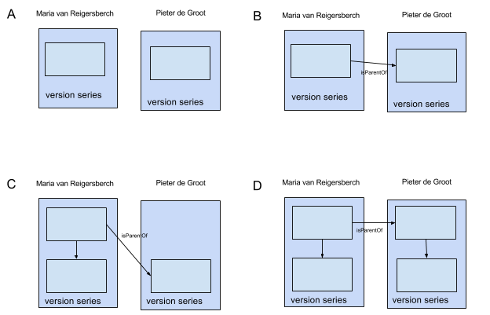

= CRUD

[WARNING]
We will probably release a new REST API for the crud service, while also maintaining the current API. The current API is sometimes a bit cumbersome to develop against.

== Summary

//tag::summary[]
The crud service offers an interpreted view of the RDF data. It might for example fold a list expressed as blank nodes in RDF into the the entity that references them.
Provenance information is included as part of the entity it belongs to.
//end::summary[]

 * todo:bug["Only the person who changed the entity last and the time at which the change was made is provided at the moment, the exact nature of the change is recorded as well but not displayed yet."]
 * todo:feature["No provenance over multiple entities or of automated transformations can be recorded at this moment."]
 * todo:feature["The interpretation is currently hard-coded, but we have plans to allow the user to specify an interpretation with the dataset as metadata."]
 * todo:feature["The entities returned by the service are currently only provided in a custom JSON format, but we are planning to also provide them as JSON-ld, graphml and n-triples"]  

== Context
Timbuctoo offers a REST interface to edit data within different datasets.
This API precedes the RDF data model and even the graph database underpinnings.
Recently we have performed a clean re-implementation of the crud API based on the graph database to clear out many intermediate layers that are no longer needed.

This package contains code that translates a timbuctoo specific JSON format into changes on the Tinkerpop graph.

== Responsibilies
This package is responsible for

 * Parsing various formats (currently excel only)
 * generating "collections" (i.e. tables, sheets, files) containing "rows" of "fields"
 * handling imports of arbitrary size (only limited by the space limitations of the target database)

It is currently not responsible for

 * converting the data to a specific data type (it should output plain text)
 * handling links (i.e. foreign keys or edges)
 * handling data that cannot be expressed as collections of rows

After an import is finished all traces of the original format should be gone.

== Data model
The timbuctoo database is divided into datasets.
Each Virtual Research Environment used to have it's own dataset and each dataset would be solely for a specific VRE.
Therefore a dataset is itself called a VRE.
A VRE has *collections*.
Within a collection there are *entities*.
Each entity belongs to one and only one collection.
The collection that an entity belongs to is also refered to as it's *type*. 
When we say *type* we are also using the singular version of the collection name, when we say *collection* we always uses the plural form.
However, pluralisation is only done by appending an 's' (So a collection of people would have *people* as type and *peoples* as collection name).

Instead of using something like OWL same-as relations timbuctoo handled the open information model by letting the reader specify along which VRE an entity should be viewed.
When viewing along one VRE the properties from that VRE were shown, requesting the same entity (same identifier) using a different VRE would show different properties.
The same identifier would refer to the same vertex, properties were namespaced by their type name.
Types are namespaced by the VRE name, making properties also namespaced by their VRE name.

VRE configuration has only recently been moved to the database, it used to be embedded in Java code.

Outside of the normal VRE's there is a VRE called Admin.

There is also a VRE called Base.

The current data model is based on the lowest common denominator of the data abstraction layer (tinkerpop2) and the database (neo4j). This means that there are:
 
 * Vertices (what neo4 calls nodes)
 * Properties
 * Edges (a relation between two vertices)

Vertices represent a version of an entity. Properties represent the values of that entity that do not warrant their own identifier. Edges represent the relations between vertices and might have properties of their own (though this happens rarely)

=== Versioning

(A, B, C & D) The light blue square represents a vertex and thus one version of the entity. In A and B there is only 1 versie of Maria and Pieter, in C there are 2 versions of Maria and 1 of Pieter and in D there are 2 versies of both Maria and Pieter. The set of vertices with the same value for the property tim_id form a singly linked list through edges of the type isVersionOf. These are grouped in a darker blue square and labeled “version series”

(B) When an edge is created between two vertices, no new version is created. Both the vertex and the relations have a created_at property so that one can identify that there was a time when the vertices did exist, but the relation did not.

(C & D) When a property is changed a new version _is_ created. The relations to the old vertex are deleted and new relations are created using the new vertex. These new relations keep their created_at date, so it is possible to find all the vertices that existed while the old vertex was active by following the isVersionOf relation up to the latest version and iterating over its relations.

(Not in the drawing) When a property of a relation is modified a new relation is created and the old one marked as obsolete. similar to vertices.

(not in th drawing) The drawing slightly misrepresents the actual workings of the data persistence code in order to make it easier to understand. In reality the duplication of the object does not happen right before a modification, but directly after a “persistent id” has been received from the handle server. The race conditions that this might introduce are prevented by disallowing writes depending on whether a persistent id is available or not. (There are three states possible: the property is non-existent, the property exists but has the value NULL and the property exists)
Variants

The current timbuctoo also code to achieve most of the goals of anansi. These goals are implemented by storing all the data of the different research projects on a certain entity in the same vertex using namespaces for the properties.
There is also 1 namespace that contains the “abstract” data that does have meaning within the domain, such as a persons name. De facto this is the data of the first research environment that entered a value for that property. This abstract-level data is currently unused.
There is also data that is not domain related, such as the isLatest property. This is again placed in its own namespace.

== Contents of this package
 * link:TinkerpopJsonCrudService.java[TinkerpopJsonCrudService] is the entry point. It contains methods for creating, reading, updating and deleting entities and will modify the database according to the above schedule.
  